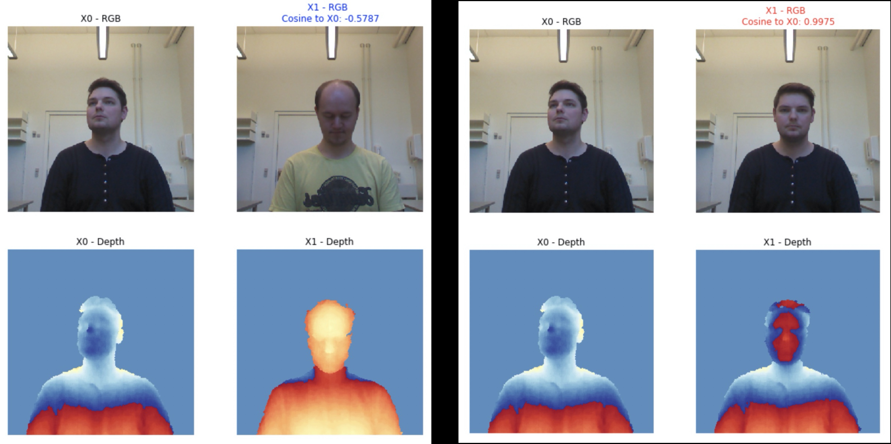

# FaceID in PyTorch
- Reimplementation of the FaceID authentication in PyTorch
- Inspired by this blog https://towardsdatascience.com/how-i-implemented-iphone-xs-faceid-using-deep-learning-in-python-d5dbaa128e1d

# Requirements
- tqdm >= 4.44.1
- numpy >= 1.18.1
- pytorch >= 1.4.0
- torchvision > 0.5.0
- tensorboard >= 2.2.0
- pytorch-lightning >= 0.7.1